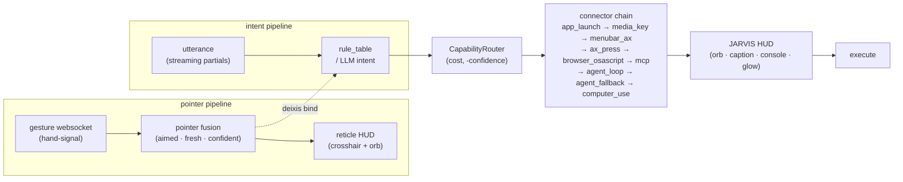

# curby-jarvis

**Voice + hand-gesture universal computer controller for macOS — point and say.**


Point at something on your screen, say what to do with it, and it does it. curby-jarvis fuses a hand-gesture pointer with spoken intent and drives **any** macOS app — no per-app plugins, no scripting. A crosshair reticle tracks where you're aiming; a preview card shows the chosen action before it runs. In v2.0.0 the open-ended path is no longer a black-box subprocess: it is a structured **AgentLoopConnector** that exposes every connector as a Claude tool and composes multi-step plans — meaning the system can now do *anything* via voice and gesture, not just a closed verb set.

---

## 🎯 Point and say

The eight golden point-and-say demos. Each runs headless through the real CLI and emits a `--dry-run` audit record — these are the regression spec, not marketing.

| Utterance | Pointer? | Chosen connector | Risk | Confirm? |
|---|:---:|---|---|:---:|
| `open Spotify` | — | `app_launch` | launch | no |
| `mute` | — | `media_key` | reversible | no |
| `close this window` | — | `menubar_ax` | irreversible | **yes** |
| `next tab` | — | `browser_tab` | reversible | no |
| `play this` | ✅ pointer | `deixis_click` | deixis-bound | no |
| `move that there` | ✅ two points | `deixis_click` | irreversible | **yes** |
| `play this` | ✘ no pointer | `deixis_click` | ambiguous | **yes** |
| _(long open-ended utterance)_ | — | `agent_loop` | ambiguous | — |

The point-and-say move (`deixis_click`) is the core: spoken deixis (*this* / *that* / *there*) is bound to the fused pointer at the moment you speak. Open-ended utterances (GD8) now route to `agent_loop` — a structured Claude tool-use loop — instead of a raw `claude -p` subprocess.

---

## 🧭 How it routes — the Hybrid CapabilityRouter

The router is an **AX-grounded spine** (macOS Accessibility) holding a chain of pluggable connectors. Connectors are ordered by **`(cost, -confidence)`**: the **cheapest connector that is both confident and available wins**. A connector **never raises** — on failure it returns a `ConnectorResult` and the router **falls through** to the next one, so routing degrades gracefully instead of crashing.

| Connector | Cost | Mechanism | TCC permission? |
|---|:---:|---|---|
| `app_launch` | 1 | NSWorkspace + URL-scheme open | **none needed** |
| `media_key` | 2 | Auxiliary HID media keys (play/pause/mute/next) | none |
| `menubar_ax` | 3 | Drives focused app's menu bar via Accessibility | Accessibility |
| `deixis_click` (ax_press) | 4 | AX press / drag at the fused pointer (*this* / *that* / *there*) | Accessibility |
| `browser_tab` (browser_osascript) | 6 | Browser tab control via warm osascript | Automation |
| `mcp` | 7 | Any configured MCP server in `~/.curby/mcp_servers.json` becomes a tool | varies |
| _(intent LLM)_ | 8 | LLM intent-parse seam | — |
| `agent_loop` | 9 | Structured Claude tool-use loop — composes multi-step plans, dispatches each tool call back through the router | — |
| `agent_fallback` | 10 | Unstructured last resort — shells to `claude -p` | — |
| `computer_use` | 11 | Pixel-level vision fallback for AX-opaque UIs | Screen Recording |

Bottom of the chain is **zero-TCC** (URL-scheme / NSWorkspace, no permission grant). The MCP bridge (cost 7) dynamically surfaces any server configured in `~/.curby/mcp_servers.json` as a router tool. The `agent_loop` (cost 9) is the primary open-ended path: it runs a Claude tool-use loop that knows about every connector and composes multi-step plans, dispatching each tool call back through the router. `computer_use` (cost 11) is a pixel-level vision fallback for UIs that are opaque to Accessibility.

---

## 🏗️ Architecture



`gesture ws → pointer fusion → reticle HUD`, in parallel with `utterance (streaming partials) → rule_table / LLM intent`. The fused pointer is bound to spoken deixis, the router picks the cheapest confident connector, the JARVIS HUD previews the action (with the frosted console card and confirm gate for irreversible ones), then it executes.

---

## 🔮 JARVIS HUD — the feedback layer

Every surface in v2.0.0 is driven by a single `SessionPhase` state machine (`idle → listening → heard → understanding → planning → acting → done/error`), so the HUD updates in unison across:

- **Animated reticle ORB** — audio-reactive, thinking-spin, and lock-on brackets; the visual focus of the crosshair.
- **Live partial-transcript caption** — streams the in-progress recognition under the crosshair as you speak.
- **Ambient screen-edge glow** — subtle colored pulse tied to the current phase.
- **Frosted Console card** — progressive disclosure: mechanism, latency chip ("did it in N ms"), undo toast.
- **Radial connector-chain diagnostic ring** — shows which rungs were tried and which won.
- **Command / undo history overlay** — scrollable record of recent actions.
- **Adaptive-ink legibility** — HUD ink auto-adjusts for readability over any background.
- **On-device sound cues** — sub-100 ms ack chime + sentence-stream TTS confirmation.

---

## ⚡ Latency model

Streaming STT partials feed a speculative rule-parse off the Speech queue so the router starts before the utterance ends. Short, deterministic commands (media, launch, tab) fire ~immediately via the cheap rungs. Longer utterances get sentence-stream TTS so the first sentence plays before the full response is ready. A barge-in signal (new utterance or open-palm STOP gesture) cancels any in-flight action. Per-stage latency is tracked with rolling P95 SLO budgets.

---

## 🤚 Iron-Man gestures

The hand-signal pointer stream feeds a gesture event bus with hysteresis and cooldown:

| Gesture | Effect |
|---|---|
| pinch | confirm the pending action |
| open palm | STOP / barge-in — cancels in-flight |
| swipe | directional verb (next/prev/scroll) |

---

## 📦 Install

```bash
pip install -e ".[dev]"
```

Requires Python 3.11+. Optional screen-capture extra for `computer_use`: `pip install -e ".[vision]"`.

## 🚀 Quickstart

Inspect a decision with **zero side effects** — `--dry-run` emits the audit JSON (chosen connector, mechanism tag, risk, `must_confirm`):

```bash
python -m curby_jarvis.app --say "open Spotify" --dry-run
```

```json
{"utterance": "open Spotify", "verb": "open", "needs_pointer": false, "chosen_connector": "app_launch", "mechanism": "app_launch", "risk": "launch", "must_confirm": false, "gloss": "spotify (not found)", "literal": "app:spotify", "target_rect": null}
```

Bind spoken deixis to a pointer (and a destination) — still a dry run:

```bash
python -m curby_jarvis.app --say "move that there" --pointer 100,200 --pointer2 800,600 --dry-run
```

```json
{"utterance": "move that there", "verb": "move", "needs_pointer": true, "chosen_connector": "deixis_click", "mechanism": "cgevent_drag", "risk": "ambiguous", "must_confirm": true, "gloss": "no element resolved here", "literal": "(100, 200) -> (800, 600)", "target_rect": null}
```

**Talk to it.** Preflight permissions once (opens the right Settings panes and
requests Microphone + Speech Recognition), then run the live controller:

```bash
python -m curby_jarvis.app --check   # mic / Speech / Accessibility / Screen-Recording / MCP / agent preflight
python -m curby_jarvis.app --live    # on-device voice in → route → confirm → execute
```

In `--live`, recognition is **on-device** (macOS Speech framework — no API key, no
network, no model download). Streaming partials feed speculative parsing off the
Speech queue so the cheap rungs respond nearly immediately. Each finished phrase is
lowered to an Intent, deixis is bound to the live gesture pointer, the cheapest
confident connector runs, and irreversible actions raise the frosted confirm card
first. The gesture reticle follows your fingertip whenever the [hand-signal](../hand-signal)
daemon is up. Optional wake word: `export CURBY_WAKE=curby` to require "curby …"
before a command.

```
say "open Spotify"        → launches Spotify          (auto)
say "mute" / "next tab"   → media key / browser tab   (auto)
say "close this window"   → menu-bar AX               (confirm)
point + say "play this"   → AX press at the pointer    (auto)
say anything open-ended   → agent_loop (Claude tools)  (per-step confirm)
```

**CLI:**

```
python -m curby_jarvis.app --say "<utterance>" [--dry-run] [--pointer X,Y] [--pointer2 X,Y] [--vision]
python -m curby_jarvis.app --live | --check
```

**Permissions (one-time).** `--live` needs **Microphone** + **Speech Recognition**
(System Settings › Privacy & Security) for voice; **Accessibility** for the
menu-bar / point-and-click connectors; **Automation** the first time a browser
tab command runs; and **Screen Recording** for `computer_use` pixel-level fallback.
`--check` reports each and opens the pane for anything missing.
App-launch and media-key commands need no permission at all.

---

## 🛡️ Safety & observability

- **Irreversible actions confirm first.** The overlay preview card blocks on confirmation before executing anything irreversible.
- **Multi-step task engine.** The `agent_loop` presents each planned step with a per-step confirm, and every executed step is logged to the undo ledger.
- **Undo ledger + session memory.** SQLite-backed; the console card surfaces an undo toast after each action.
- **Per-utterance trace_id telemetry.** Each utterance gets a trace ID; all routing decisions are written to a JSONL log (OTel-GenAI-aligned) for observability.
- **Per-connector circuit breakers.** A connector that fails repeatedly trips its breaker and the router skips it; degraded-mode routing continues with the remaining chain.
- **One-time execution-grant token vault.** Sensitive agent actions require a one-time grant so they can't be silently replayed.
- **Secure-Input block.** When macOS Secure Input is active (a password field is focused), keystroke injection is refused.
- **Watchdog-wrapped AX.** Every Accessibility call is timeout-wrapped — a timeout falls through to the next connector and never hangs.
- **Connectors never raise.** Errors come back inside a `ConnectorResult`, so routing degrades gracefully instead of crashing.
- **Mechanism tags.** Each connector's `.name` doubles as its telemetry mechanism tag.
- **Audit JSON.** The `--dry-run` record is the inspectable, diffable decision log — and the source of truth for the golden harness.

---

## 🗂️ Project layout

```
src/curby_jarvis/           49 modules, ~11 500 src LOC
├── app.py                  CLI entrypoint + --live controller + --check preflight
├── stt.py                  on-device voice in (Speech framework + AVAudioEngine)
├── router.py               Hybrid CapabilityRouter (cost, -confidence) chain
├── rule_table.py           golden lowering: utterance -> verb/intent
├── intent.py               intent model + LLM parse seam
├── prewarm.py              warms osascript + browser so first command is fast
├── session_phase.py        SessionPhase state machine (idle/listening/.../done/error)
├── telemetry.py            per-utterance trace_id + JSONL/OTel-GenAI-aligned logging
├── undo_ledger.py          SQLite-backed undo log + session memory
├── circuit_breaker.py      per-connector circuit breakers + degraded-mode routing
├── connectors/
│   ├── app_launch.py       cost 1   NSWorkspace + URL scheme (zero TCC)
│   ├── media_transport.py  cost 2   HID media keys
│   ├── menu_command.py     cost 3   focused app's menu bar via AX
│   ├── deixis_click.py     cost 4   AX press/drag at the fused pointer
│   ├── browser_tab.py      cost 6   tab control via warm osascript
│   ├── mcp_connector.py    cost 7   MCP bridge (~/.curby/mcp_servers.json → tool)
│   ├── intent_parse.py     cost 8   LLM intent parse
│   ├── agent_loop.py       cost 9   Claude tool-use loop (multi-step planner)
│   ├── agent_fallback.py   cost 10  last resort -> claude -p
│   └── computer_use.py     cost 11  pixel-level vision fallback (Screen Recording)
├── pointer/
│   ├── ws_client.py        consumes the hand-signal gesture websocket
│   ├── fusion.py           fuses aimed/fresh/confident samples
│   ├── gesture_bus.py      gesture event bus: pinch/open-palm/swipe + hysteresis
│   └── calibration.py      screen mapping
├── overlay/
│   ├── reticle.py          animated ORB reticle HUD (audio-reactive, lock-on)
│   ├── preview_card.py     Frosted Console card (action + latency chip + undo toast)
│   ├── caption.py          live partial-transcript caption under the crosshair
│   ├── edge_glow.py        ambient screen-edge glow tied to SessionPhase
│   ├── diag_ring.py        radial connector-chain diagnostic ring
│   ├── history_overlay.py  command / undo history overlay
│   └── adaptive_ink.py     HUD ink contrast
├── ax/
│   ├── ax_bridge.py        watchdog-wrapped Accessibility calls
│   └── secure_input.py     Secure-Input detection / keystroke refusal
└── (cgevent · screen · macwin · osascript_bridge)  low-level helpers
```

---

## ✅ Status & tests

**Status: v2.0.0 — open-ended voice + gesture controller. Anything Claude can do, you can say.**

The complete loop runs end-to-end: `--check` requests/reports the mic, Speech,
Accessibility, Screen Recording, MCP, and agent prerequisites; `--live` listens
on-device with streaming partials, routes each spoken phrase through the connector
chain (up to `agent_loop` for open-ended tasks), binds deixis to the live pointer,
and gates irreversible actions on the frosted confirm card. Everything below the
voice layer stays fully headless-testable.

Fully headless suite (on-device STT endpointing + utterance normalization, the
live dispatch/confirm/reticle wiring with fakes, pointer fusion/calibration/ws-client,
all connectors including agent_loop / MCP / computer_use, overlay surfaces, `rule_table`
golden lowering, telemetry, circuit breakers, undo ledger, and the golden harness
that drives all 8 demos through the real CLI):

```bash
QT_QPA_PLATFORM=offscreen .venv/bin/python -m pytest -q
```

**742 passed, 4 skipped.**

---

## License

MIT.
