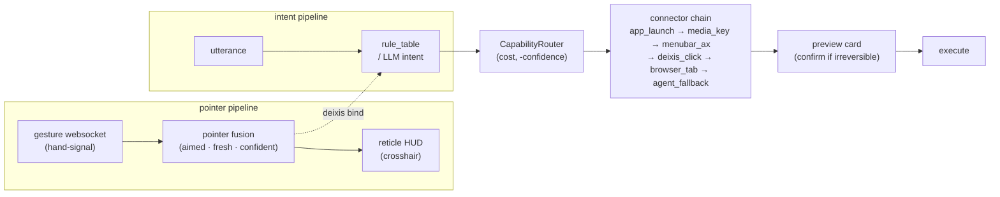

# curby-jarvis

**Voice + hand-gesture universal computer controller for macOS — point and say.**


Point at something on your screen, say what to do with it, and it does it. curby-jarvis fuses a hand-gesture pointer with spoken intent and drives **any** macOS app — no per-app plugins, no scripting. A crosshair reticle tracks where you're aiming; a preview card shows the chosen action before it runs.

---

## 🎯 Point and say

The eight golden point-and-say demos. Each runs headless through the real CLI and emits a `--dry-run` audit record — these are the regression spec, not marketing.

| Utterance | Pointer? | Chosen connector | Risk | Confirm? |
|---|:---:|---|---|:---:|
| `open Spotify` | — | `app_launch` | launch | no |
| `mute` | — | `media_key` | reversible | no |
| `close this window` | — | `menubar_ax` | irreversible | **yes** |
| `next tab` | — | `browser_tab` | reversible | no |
| `play this` | ✅ pointer | `deixis_click` | deixis-bound | no |
| `move that there` | ✅ two points | `deixis_click` | irreversible | **yes** |
| `play this` | ✘ no pointer | `deixis_click` | ambiguous | **yes** |
| _(long open-ended utterance)_ | — | `agent_fallback` | ambiguous | — |

The point-and-say move (`deixis_click`) is the core: spoken deixis (*this* / *that* / *there*) is bound to the fused pointer at the moment you speak.

---

## 🧭 How it routes — the Hybrid CapabilityRouter

The router is an **AX-grounded spine** (macOS Accessibility) holding a chain of pluggable connectors. Connectors are ordered by **`(cost, -confidence)`**: the **cheapest connector that is both confident and available wins**. A connector **never raises** — on failure it returns a `ConnectorResult` and the router **falls through** to the next one, so routing degrades gracefully instead of crashing.

| Connector | Cost | Mechanism | TCC permission? |
|---|:---:|---|---|
| `app_launch` | 1 | NSWorkspace + URL-scheme open | **none needed** |
| `media_key` | 2 | Auxiliary HID media keys (play/pause/mute/next) | none |
| `menubar_ax` | 3 | Drives focused app's menu bar via Accessibility | Accessibility |
| `deixis_click` | 4 | AX press / drag at the fused pointer (*this* / *that* / *there*) | Accessibility |
| `browser_tab` | 6 | Browser tab control via warm osascript | Automation |
| _(intent LLM)_ | 8 | LLM intent-parse seam | — |
| `agent_fallback` | 10 | Open-ended last resort — shells to `claude -p` | — |

Bottom of the chain is **zero-TCC** (URL-scheme / NSWorkspace, no permission grant). Above it: a warm-osascript browser hatch, an LLM intent parser, and a `claude -p` agent as the always-available tail.

---

## 🏗️ Architecture



`gesture ws → pointer fusion → reticle HUD`, in parallel with `utterance → rule_table / LLM intent`. The fused pointer is bound to spoken deixis, the router picks the cheapest confident connector, the preview card shows the action (and asks confirm for irreversible ones), then it executes.

---

## 📦 Install

```bash
pip install -e ".[dev]"
```

Requires Python 3.11+. Optional screen-capture extra: `pip install -e ".[vision]"`.

## 🚀 Quickstart

Inspect a decision with **zero side effects** — `--dry-run` emits the audit JSON (chosen connector, mechanism tag, risk, `must_confirm`):

```bash
python -m curby_jarvis.app --say "open Spotify" --dry-run
```

```json
{"utterance": "open Spotify", "verb": "open", "needs_pointer": false, "chosen_connector": "app_launch", "mechanism": "app_launch", "risk": "launch", "must_confirm": false, "gloss": "spotify (not found)", "literal": "app:spotify", "target_rect": null}
```

Bind spoken deixis to a pointer (and a destination) — still a dry run:

```bash
python -m curby_jarvis.app --say "move that there" --pointer 100,200 --pointer2 800,600 --dry-run
```

```json
{"utterance": "move that there", "verb": "move", "needs_pointer": true, "chosen_connector": "deixis_click", "mechanism": "cgevent_drag", "risk": "ambiguous", "must_confirm": true, "gloss": "no element resolved here", "literal": "(100, 200) -> (800, 600)", "target_rect": null}
```

Run the real loop (pointer stream → fusion → reticle HUD → utterance → route → confirm → execute):

```bash
python -m curby_jarvis.app --live
```

**CLI:**

```
python -m curby_jarvis.app --say "<utterance>" [--dry-run] [--pointer X,Y] [--pointer2 X,Y] [--vision] [--live]
```

---

## 🛡️ Safety & observability

- **Irreversible actions confirm first.** The overlay preview card blocks on confirmation before executing anything irreversible.
- **Secure-Input block.** When macOS Secure Input is active (a password field is focused), keystroke injection is refused.
- **Watchdog-wrapped AX.** Every Accessibility call is timeout-wrapped — a timeout falls through to the next connector and never hangs.
- **Connectors never raise.** Errors come back inside a `ConnectorResult`, so routing degrades gracefully instead of crashing.
- **Mechanism tags.** Each connector's `.name` doubles as its telemetry mechanism tag.
- **Audit JSON.** The `--dry-run` record is the inspectable, diffable decision log — and the source of truth for the golden harness.

---

## 🗂️ Project layout

```
src/curby_jarvis/
├── app.py                  CLI entrypoint + --live run loop
├── router.py               Hybrid CapabilityRouter (cost, -confidence) chain
├── rule_table.py           golden lowering: utterance -> verb/intent
├── intent.py               intent model + LLM parse seam
├── prewarm.py              warms osascript + browser so first command is fast
├── connectors/
│   ├── app_launch.py       cost 1  NSWorkspace + URL scheme (zero TCC)
│   ├── media_transport.py  cost 2  HID media keys
│   ├── menu_command.py     cost 3  focused app's menu bar via AX
│   ├── deixis_click.py     cost 4  AX press/drag at the fused pointer
│   ├── browser_tab.py      cost 6  tab control via warm osascript
│   ├── intent_parse.py     cost 8  LLM intent parse
│   └── agent_fallback.py   cost 10 last resort -> claude -p
├── pointer/
│   ├── ws_client.py        consumes the hand-signal gesture websocket
│   ├── fusion.py           fuses aimed/fresh/confident samples
│   └── calibration.py      screen mapping
├── overlay/
│   ├── reticle.py          crosshair reticle HUD at the pointer
│   ├── preview_card.py     shows action + mechanism + risk; confirms
│   └── adaptive_ink.py     HUD ink contrast
├── ax/
│   ├── ax_bridge.py        watchdog-wrapped Accessibility calls
│   └── secure_input.py     Secure-Input detection / keystroke refusal
└── (cgevent · screen · macwin · osascript_bridge)  low-level helpers
```

---

## ✅ Status & tests

**Status: v0.1 — headless-green (248 tests); live-machine integration pending.**

Fully headless suite (pointer fusion/calibration/ws-client, all 7 connectors, overlay reticle + preview card, `rule_table` golden lowering, and the golden harness that drives all 8 demos through the real CLI):

```bash
QT_QPA_PLATFORM=offscreen .venv/bin/python -m pytest -q
```

**248 passed, 1 skipped.**

---

## License

MIT.
